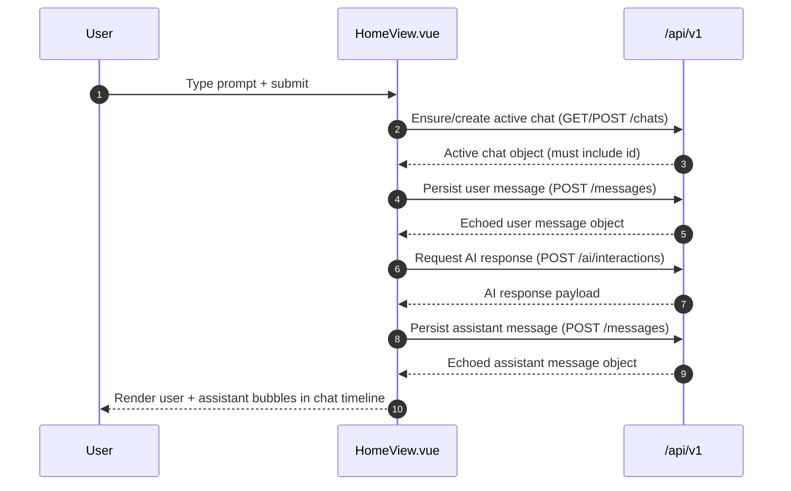

# Home chat interaction sequence (frontend-only, no backend changes)

## Scope

This flow is for `HomeView.vue` integration only and assumes current backend behavior remains unchanged:

- `POST /api/v1/chats` and `POST /api/v1/messages` are pass-through writes (payload stored and echoed as-is).
- `POST /api/v1/ai/interactions` accepts `prompt` (plus optional future keys) and returns provider output.

## End-to-end sequence for one prompt



## Step contracts (minimum frontend payloads)

> Because chats/messages are pass-through today, frontend must send fields it needs later (especially IDs).

### 1) Ensure/create active chat (`/api/v1/chats`)

#### Read attempt
- **Request**: `GET /api/v1/chats`
- **Frontend use**: locate active chat for session/user (or none).

#### Create when missing
- **Request**: `POST /api/v1/chats`
- **Minimum payload**:

```json
{
  "id": 1700000000001,
  "title": "Home chat",
  "start": "2026-02-10T15:30:00Z",
  "model": "gpt-4o-mini",
  "user": "student_1"
}
```

- **Required for frontend continuity**:
  - `id` (client-generated for now; backend does not mint one in pass-through mode)
  - `model`, `user` (for local filtering/resume)
- **Expected response**: exact payload echo.

### 2) Persist user message (`/api/v1/messages`)

- **Request**: `POST /api/v1/messages`
- **Minimum payload**:

```json
{
  "id": 1700000000002,
  "chat_id": 1700000000001,
  "message_text": "Explain mitochondria in simple terms",
  "help_intent": "summarization"
}
```

- **Required**:
  - `id` (client-generated)
  - `chat_id` (active chat link)
  - `message_text` (display content)
- **Optional**: `vote`, `note` (can be omitted until feedback/note features are wired).
- **Expected response**: exact payload echo.

### 3) Request AI response (`POST /api/v1/ai/interactions`)

- **Request**: `POST /api/v1/ai/interactions`
- **Minimum payload**:

```json
{
  "prompt": "Explain mitochondria in simple terms"
}
```

- **Optional forward-compatible fields**: `system_prompt`, `rag`.
- **Minimum frontend-read response contract**:
  - Prefer `response.summary` when present.
  - If absent, fallback to stringified JSON / safe generic text.
- **Expected status**: `200` success, `400` request issue, `502` upstream/provider issue.

### 4) Persist assistant message (`/api/v1/messages`)

- **Request**: `POST /api/v1/messages`
- **Minimum payload**:

```json
{
  "id": 1700000000003,
  "chat_id": 1700000000001,
  "message_text": "Mitochondria are the part of the cell that helps produce energy.",
  "help_intent": "summarization"
}
```

- **Required**:
  - `id`, `chat_id`, `message_text`
- **Expected response**: exact payload echo.

## Failure handling policy (by step)

### Global UI rules
- Keep typed prompt in composer until assistant message persistence succeeds.
- Use a top-level error banner with concise action text.
- Disable duplicate submit while a round-trip is in progress.

### Step 1: Ensure/create chat fails
- **Banner**: “Couldn’t start chat. Please retry.”
- **Retry**: 1 immediate retry (e.g., after 300–500 ms), then stop.
- **Prompt preservation**: keep prompt text untouched.
- **Do not proceed** to message/AI steps.

### Step 2: Persist user message fails
- **Banner**: “Message not saved. Retry sending?”
- **Retry**: 1 retry.
- **Prompt preservation**: keep prompt text; do not clear composer.
- **Do not call AI** until user message save succeeds.

### Step 3: AI interaction fails
- **Banner**:
  - `400`: “Prompt was rejected. Please edit and retry.”
  - `502`/network: “AI is temporarily unavailable. Please retry.”
- **Retry**: no silent retry; explicit user retry only.
- **Prompt preservation**: keep prompt text for editing/resubmission.
- User message remains in timeline if step 2 succeeded.

### Step 4: Persist assistant message fails
- **Banner**: “Response generated but couldn’t be saved. Retry save?”
- **Retry**: 1 retry for save operation.
- **Prompt preservation**: clear prompt only after save succeeds.
- **UI behavior**: keep assistant text visible as “unsaved” state until save completes/fails definitively.

## Completion criteria for first integrated vertical slice

A first slice is done when all are true in `HomeView`:

1. Submitting one prompt triggers the 4-step sequence in order.
2. A chat is ensured/created and reused for the same page session.
3. User message appears in UI and maps to saved `/messages` payload.
4. AI response appears in UI (from `/ai/interactions`).
5. Assistant message is posted to `/messages` and success is reflected in UI.
6. Any single-step failure shows banner and preserves the typed prompt.
7. No backend code changes are required.
